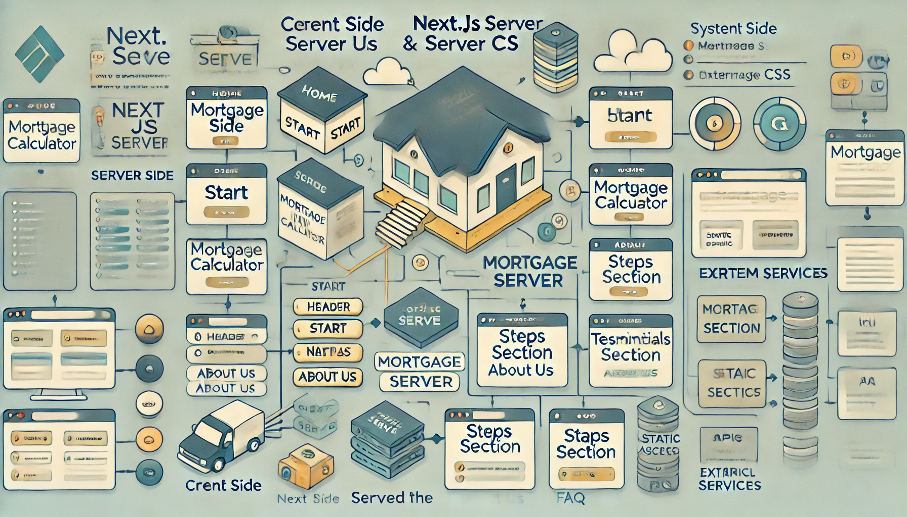

# Better.com Clone - React & Next.js Application

This project is a multi-page web application built using React with Next.js. The app replicates four pages from Better.com, including the **Home**, **About Us**, **Mortgage Calculator**, and **Start** pages. The Mortgage Calculator is interactive and responsive, allowing users to calculate estimated monthly mortgage payments.

## Features

- Fully responsive design, closely matching the original Better.com layout.
- Interactive **Mortgage Calculator** with form inputs for home price, interest rate, etc.
- React-based component architecture.
- Styled using `styled-components` or SCSS for styling and responsiveness.
- Routing between pages using Next.js’ built-in routing.

## Pages

1. **Home Page**: Overview of the Better.com website.
2. **About Us Page**: Information about the company.
3. **Mortgage Calculator Page**: Interactive calculator to estimate monthly payments.
4. **Start Page**: Getting started with Better.com.

## System Design



## Getting Started

### Prerequisites

- Node.js (version >= 14)
- npm or yarn

### Installation

1. Clone the repository:
   ```bash
   git clone https://github.com/tirthanprajapati/Medius-Teechnology-Assignment
   cd better-replica
   ```

2. Install dependencies:
   ```bash
   npm install
   ```

3. Run the development server:
   ```bash
   npm run dev
   ```
   Open [http://localhost:3000](http://localhost:3000) to view the app in your browser.

### Build and Deploy

1. Build the app for production:
   ```bash
   npm run build
   ```

2. Start the production server:
   ```bash
   npm start
   ```

3. Deploy on **Vercel**:
   - Install the Vercel CLI:
     ```bash
     npm install -g vercel
     ```
   - Deploy the project:
     ```bash
     vercel
     ```

## Technologies Used

- **React**: A JavaScript library for building user interfaces.
- **Next.js**: A React framework with built-in support for routing, server-side rendering, and more.
- **Styled-Components**: For styling the application with CSS-in-JS (or alternatively SCSS).
- **Vercel**: Deployment platform.